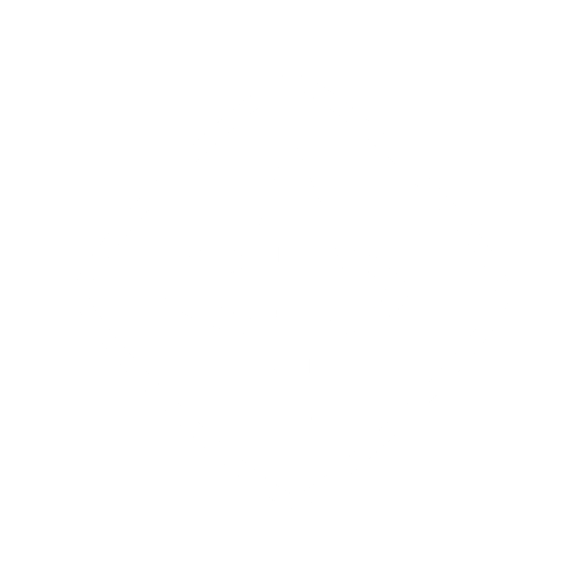

<!-- Main -->

<!-- One -->
<section id="one">
	

		<header class="major">
			<h1>Education</h1>
		</header>

<!-- Content -->

	<table >
		<thead>
			<tr>
				<th class="icon">  </th>
				<th> <h2> University of Pennsylvania </h2> </th>
			</tr>
		</thead>
	</table>

Praesent ac adipiscing ullamcorper semper ut amet ac risus. Lorem sapien ut odio odio nunc. Ac adipiscing nibh porttitor erat risus justo adipiscing adipiscing amet placerat accumsan. Vis. Faucibus odio magna tempus adipiscing a non. In mi primis arcu ut non accumsan vivamus ac blandit adipiscing adipiscing arcu metus praesent turpis eu ac lacinia nunc ac commodo gravida adipiscing eget accumsan ac nunc adipiscing adipiscing.

	<table >
		<thead>
			<tr>
				<th class="icon">  </th>
				<th> <h2> Temple University Honors College </h2> </th>
			</tr>
		</thead>
	</table>

Praesent ac adipiscing ullamcorper semper ut amet ac risus. Lorem sapien ut odio odio nunc. Ac adipiscing nibh porttitor erat risus justo adipiscing adipiscing amet placerat accumsan. Vis. Faucibus odio magna tempus adipiscing a non. In mi primis arcu ut non accumsan vivamus ac blandit adipiscing adipiscing arcu metus praesent turpis eu ac lacinia nunc ac commodo gravida adipiscing eget accumsan ac nunc adipiscing adipiscing.

	<table >
		<thead>
			<tr>
				<th class="icon">  </th>
				<th> <h2> Coursera / deeplearning.ai </h2> </th>
			</tr>
		</thead>
	</table>

Praesent ac adipiscing ullamcorper semper ut amet ac risus. Lorem sapien ut odio odio nunc. Ac adipiscing nibh porttitor erat risus justo adipiscing adipiscing amet placerat accumsan. Vis. Faucibus odio magna tempus adipiscing a non. In mi primis arcu ut non accumsan vivamus ac blandit adipiscing adipiscing arcu metus praesent turpis eu ac lacinia nunc ac commodo gravida adipiscing eget accumsan ac nunc adipiscing adipiscing.

</section>

<!-- Two -->
<section id="two">
	

		<header class="major">
			<h1>Experience</h1>
		</header>
		
<!-- Content -->

	<table >
		<thead>
			<tr>
				<th class="icon">  </th>
				<th> <h2> Lockheed Martin </h2> </th>
			</tr>
		</thead>
	</table>

Praesent ac adipiscing ullamcorper semper ut amet ac risus. Lorem sapien ut odio odio nunc. Ac adipiscing nibh porttitor erat risus justo adipiscing adipiscing amet placerat accumsan. Vis. Faucibus odio magna tempus adipiscing a non. In mi primis arcu ut non accumsan vivamus ac blandit adipiscing adipiscing arcu metus praesent turpis eu ac lacinia nunc ac commodo gravida adipiscing eget accumsan ac nunc adipiscing adipiscing.

	<table >
		<thead>
			<tr>
				<th class="icon">  </th>
				<th> <h2> Multimodal Sensing and Imaging Laboratory </h2> </th>
			</tr>
		</thead>
	</table>

Praesent ac adipiscing ullamcorper semper ut amet ac risus. Lorem sapien ut odio odio nunc. Ac adipiscing nibh porttitor erat risus justo adipiscing adipiscing amet placerat accumsan. Vis. Faucibus odio magna tempus adipiscing a non. In mi primis arcu ut non accumsan vivamus ac blandit adipiscing adipiscing arcu metus praesent turpis eu ac lacinia nunc ac commodo gravida adipiscing eget accumsan ac nunc adipiscing adipiscing.

	<table >
		<thead>
			<tr>
				<th class="icon">  </th>
				<th> <h2> Nasa Robotic Mining Competition </h2> </th>
			</tr>
		</thead>
	</table>

Praesent ac adipiscing ullamcorper semper ut amet ac risus. Lorem sapien ut odio odio nunc. Ac adipiscing nibh porttitor erat risus justo adipiscing adipiscing amet placerat accumsan. Vis. Faucibus odio magna tempus adipiscing a non. In mi primis arcu ut non accumsan vivamus ac blandit adipiscing adipiscing arcu metus praesent turpis eu ac lacinia nunc ac commodo gravida adipiscing eget accumsan ac nunc adipiscing adipiscing.

	<table >
		<thead>
			<tr>
				<th class="icon">  </th>
				<th> <h2> Diamond Peer Teaching </h2> </th>
			</tr>
		</thead>
	</table>

Praesent ac adipiscing ullamcorper semper ut amet ac risus. Lorem sapien ut odio odio nunc. Ac adipiscing nibh porttitor erat risus justo adipiscing adipiscing amet placerat accumsan. Vis. Faucibus odio magna tempus adipiscing a non. In mi primis arcu ut non accumsan vivamus ac blandit adipiscing adipiscing arcu metus praesent turpis eu ac lacinia nunc ac commodo gravida adipiscing eget accumsan ac nunc adipiscing adipiscing.

</section>

<!-- Three -->
<section id="three">
	

		<header class="major">
			<h1>Involvements</h1>
		</header>

	<table >
		<thead>
			<tr>
				<th class="icon">  </th>
				<th> <h2> Institute of Electrical and Electronics Engineers </h2> </th>
			</tr>
		</thead>
	</table>

Praesent ac adipiscing ullamcorper semper ut amet ac risus. Lorem sapien ut odio odio nunc. Ac adipiscing nibh porttitor erat risus justo adipiscing adipiscing amet placerat accumsan. Vis. Faucibus odio magna tempus adipiscing a non. In mi primis arcu ut non accumsan vivamus ac blandit adipiscing adipiscing arcu metus praesent turpis eu ac lacinia nunc ac commodo gravida adipiscing eget accumsan ac nunc adipiscing adipiscing.

	<table >
		<thead>
			<tr>
				<th class="icon">  </th>
				<th> <h2> Eta Kappa Nu </h2> </th>
			</tr>
		</thead>
	</table>

Praesent ac adipiscing ullamcorper semper ut amet ac risus. Lorem sapien ut odio odio nunc. Ac adipiscing nibh porttitor erat risus justo adipiscing adipiscing amet placerat accumsan. Vis. Faucibus odio magna tempus adipiscing a non. In mi primis arcu ut non accumsan vivamus ac blandit adipiscing adipiscing arcu metus praesent turpis eu ac lacinia nunc ac commodo gravida adipiscing eget accumsan ac nunc adipiscing adipiscing.

	<table >
		<thead>
			<tr>
				<th class="icon">  </th>
				<th> <h2> ECE Student Advisory Council </h2> </th>
			</tr>
		</thead>
	</table>

Praesent ac adipiscing ullamcorper semper ut amet ac risus. Lorem sapien ut odio odio nunc. Ac adipiscing nibh porttitor erat risus justo adipiscing adipiscing amet placerat accumsan. Vis. Faucibus odio magna tempus adipiscing a non. In mi primis arcu ut non accumsan vivamus ac blandit adipiscing adipiscing arcu metus praesent turpis eu ac lacinia nunc ac commodo gravida adipiscing eget accumsan ac nunc adipiscing adipiscing.

</section>

<!-- Four -->
<section id="four">
	

		<header class="major">
			<h1>Skills</h1>
		</header>

	

		

			<table >
				<thead>
					<tr>
						<th> <i class="material-icons" style="font-size:40px;color:white;">code</i> </th>
						<th> <h3> Languages </h3> </th>
					</tr>
				</thead>
			</table>
		

		<ul class="alt">
			<li>C / C++</li>
			<li>Python</li>
			<li>VHDL / Verilog</li>
			<li>MATLAB</li>
			<li>LaTeX</li>
			<li>AVR ASM</li>
		</ul>
	

	

		

			<table >
				<thead>
					<tr>
						<th> <i class="material-icons" style="font-size:40px;color:white;">dashboard</i> </th>
						<th> <h3> Architectures </h3> </th>
					</tr>
				</thead>
			</table>
		

		<ul class="alt">
			<li>ARM</li>
			<li>Xilinx SoC</li>
			<li>FPGA</li>
			<li>PSoC</li>
			<li>AVR</li>
			<li>MSP</li>
		</ul>
	

	

		

			<table >
				<thead>
					<tr>
						<th> <i class="material-icons" style="font-size:40px;color:white;">merge_type</i> </th>
						<th> <h3> Paradigms </h3> </th>
					</tr>
				</thead>
			</table>
		

		<ul class="alt">
			<li>Agile Development</li>
			<li>Version Control</li>
			<li>Real-Time Operating Systems</li>
			<li>Bare-Metal Programming</li>
			<li>Finite State Machines</li>
			<li>Red Hat Linux</li>
		</ul>
	

</section>
