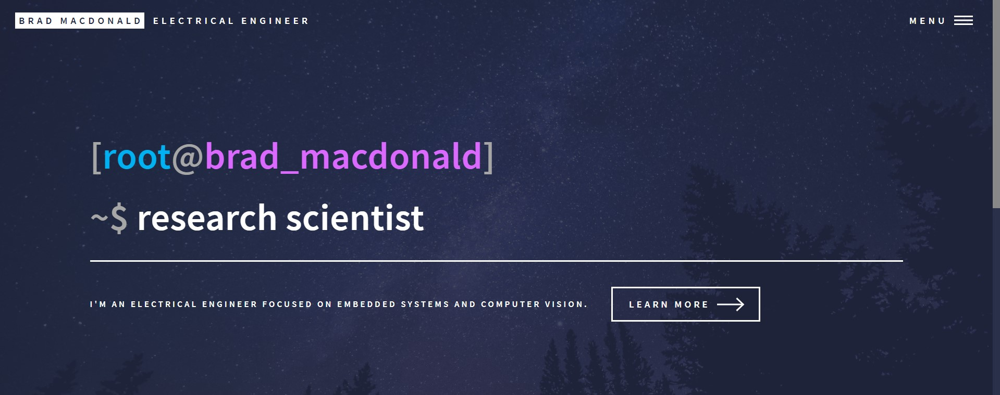

<!-- Main -->

<!-- One -->
<section id="one">
	

		<header class="major">
			<h2>I like to explore new technologies and ideas.</h2>
		</header>
		
This is my space to document personal projects, programs I've contributed to, and teams I've been a part of. I've always loved seeing the cool things people do with in spare time, especially with regards to computer vision and deep learning. My passion lies with embedded systems & software that can do complicated things in real-time with limited hardware.

	

</section>

<!-- Two -->
<section id="two" class="spotlights">
	<section>
		
		

			

				<header class="major">
					<h3>Rotary Phone Pulse to DTMF Encoder</h3>
				</header>
				
Nullam et orci eu lorem consequat tincidunt vivamus et sagittis magna sed nunc rhoncus condimentum sem. In efficitur ligula tate urna. Maecenas massa sed magna lacinia magna pellentesque lorem ipsum dolor. Nullam et orci eu lorem consequat tincidunt. Vivamus et sagittis tempus.

				<ul class="actions">
					<li><a href="generic.html" class="button">Learn more</a></li>
				</ul>
			

		

	</section>
	<section>
		
		

			

				<header class="major">
					<h3>CNN Architecture for Seizure Detection</h3>
				</header>
				
Nullam et orci eu lorem consequat tincidunt vivamus et sagittis magna sed nunc rhoncus condimentum sem. In efficitur ligula tate urna. Maecenas massa sed magna lacinia magna pellentesque lorem ipsum dolor. Nullam et orci eu lorem consequat tincidunt. Vivamus et sagittis tempus.

				<ul class="actions">
					<li><a href="generic.html" class="button">Learn more</a></li>
				</ul>
			

		

	</section>
	<section>
		
		

			

				<header class="major">
					<h3>Smartglasses for Amblyopia Patching Compliance</h3>
				</header>
				
Nullam et orci eu lorem consequat tincidunt vivamus et sagittis magna sed nunc rhoncus condimentum sem. In efficitur ligula tate urna. Maecenas massa sed magna lacinia magna pellentesque lorem ipsum dolor. Nullam et orci eu lorem consequat tincidunt. Vivamus et sagittis tempus.

				<ul class="actions">
					<li><a href="generic.html" class="button">Learn more</a></li>
				</ul>
			

		

	</section>
	<section>
		
		

			

				<header class="major">
					<h3>Xilinx "Zybo" Real-Time Digital Filtering using FreeRTOS</h3>
				</header>
				
Nullam et orci eu lorem consequat tincidunt vivamus et sagittis magna sed nunc rhoncus condimentum sem. In efficitur ligula tate urna. Maecenas massa sed magna lacinia magna pellentesque lorem ipsum dolor. Nullam et orci eu lorem consequat tincidunt. Vivamus et sagittis tempus.

				<ul class="actions">
					<li><a href="generic.html" class="button">Learn more</a></li>
				</ul>
			

		

	</section>
	<section>
		
		

			

				<header class="major">
					<h3>This Website</h3>
				</header>
				
<a href="">bradmacdonald.me</a> is hosted on GitHub Pages, and was created using Jekyll, a static site generator. The webpage styling is controlled through a combination of HTML, CSS, JavaScript, and Django.

				<ul class="actions">
					<li><a href="" class="button">See more</a></li>
				</ul>
			

		

	</section>
</section>

<!-- Three -->
<section id="three">
	

		<header class="major">
			<h2>And many more to come!</h2>
		</header>
		
I hope you enjoyed reading through some of the projects I've completed. I'm always looking for new and exciting things to try out; if you have any suggestions, reach out below!

	

</section>

